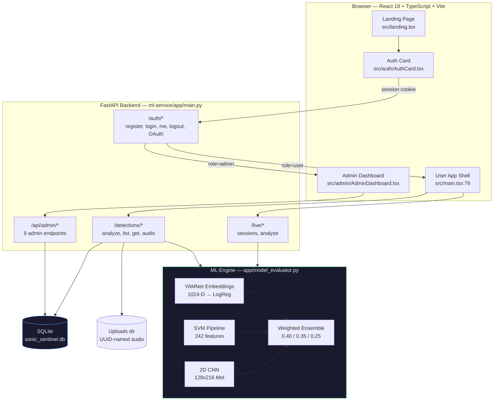
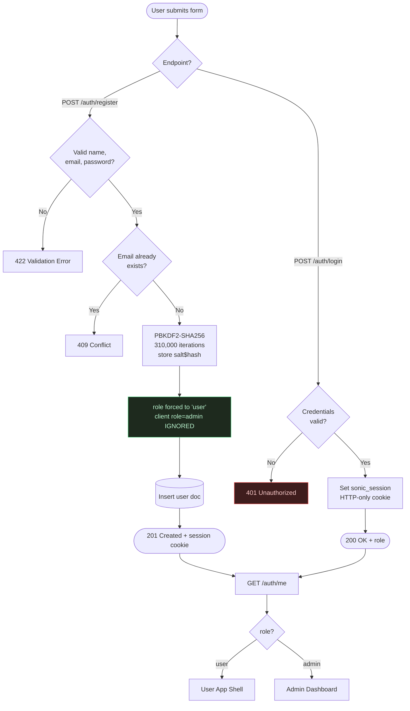
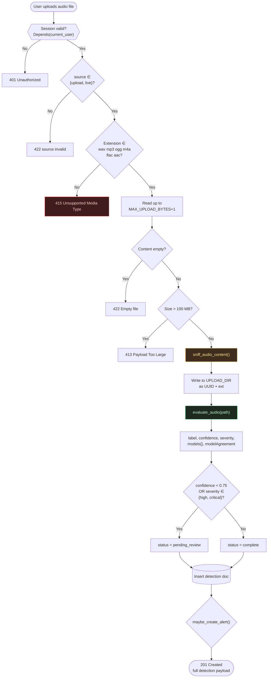
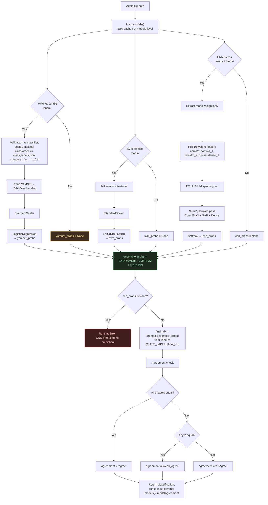
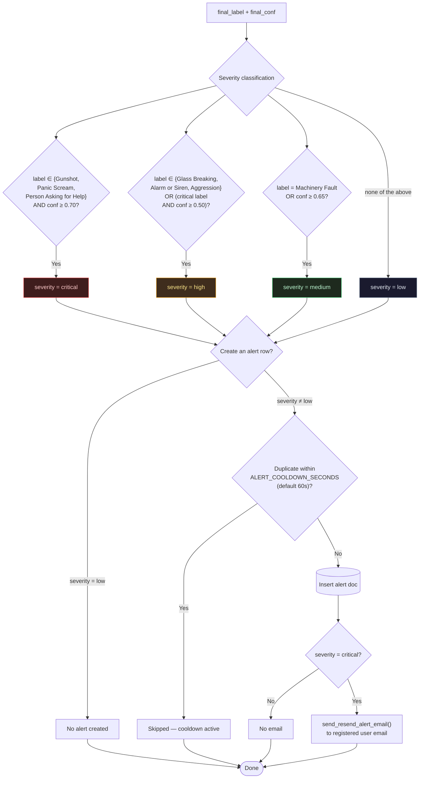
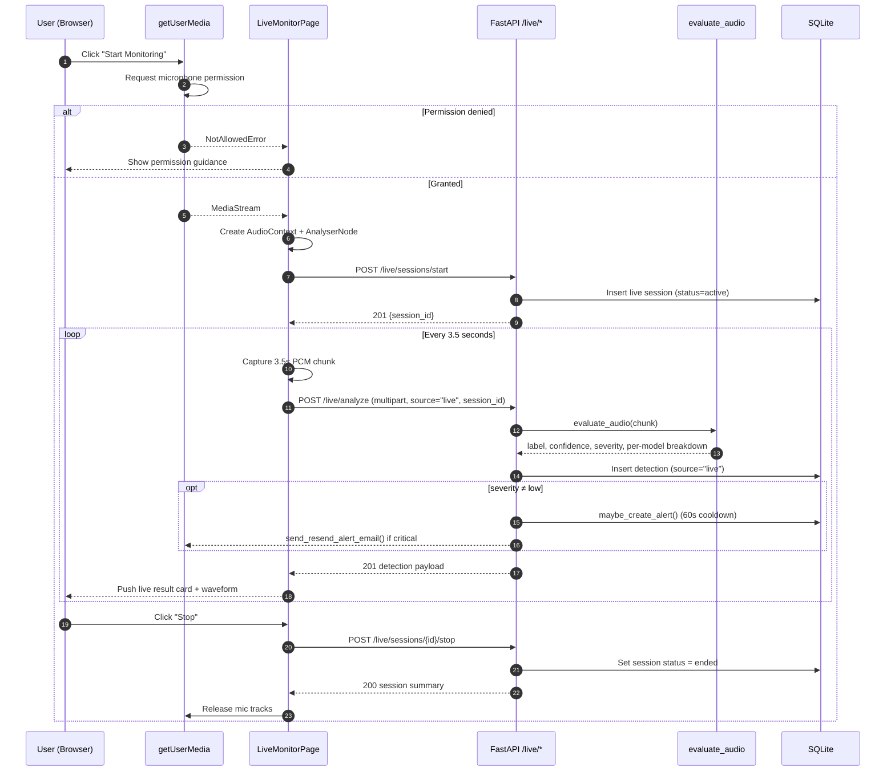
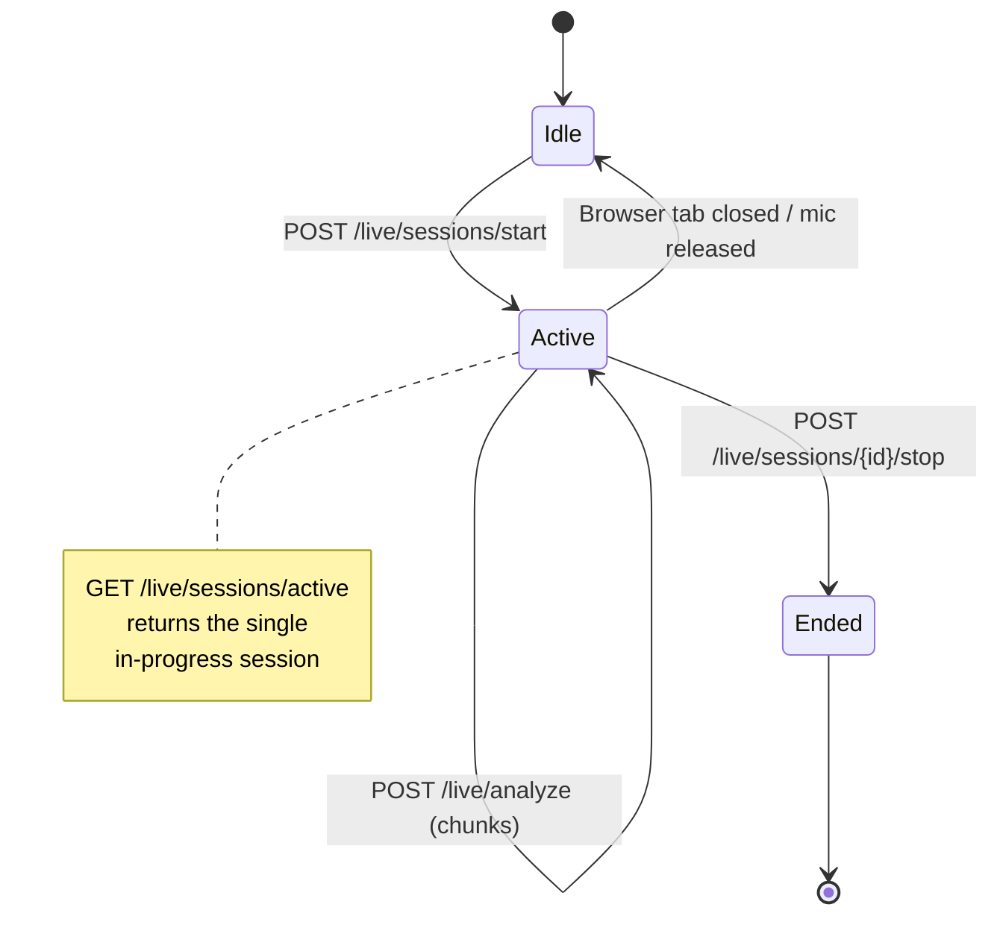
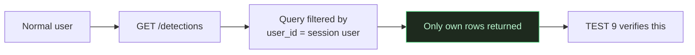
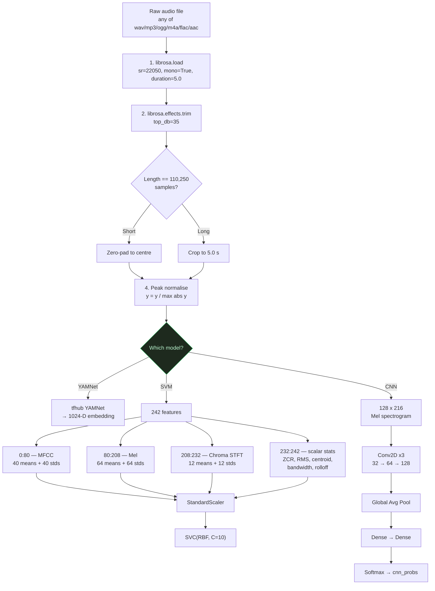

# SonicSentinel AI — Verified Flow Diagrams

All diagrams in this file are **derived directly from the shipped source code**. Each one cites
the exact file and line ranges that implement the flow, so every box can be traced to code.

**Traceability index**

| # | Diagram | Implemented in |
|---|---------|----------------|
| 1 | System architecture | `ml-service/app/main.py`, `src/main.tsx` |
| 2 | Authentication & session flow | `main.py:508–571` |
| 3 | Audio upload → classification flow | `main.py:730–779` |
| 4 | 3-model ensemble inference flow | `app/model_evaluator.py:66–360` |
| 5 | Severity & alert decision flow | `model_evaluator.py:329–341`, `main.py:676–702` |
| 6 | Live microphone flow | `main.py:977–1090` |
| 7 | RBAC / admin access control | `main.py:1099–1500` |
| 8 | Audio preprocessing pipeline | `model_evaluator.py` (librosa section) |

---

## 1. System Architecture



> **Note on the diagram set:** this file supersedes the placeholder `.md` briefs in this folder
> (e.g. `system-architecture.md`, `authentication-flow.md`) which currently contain only
> `Diagram evidence: PENDING VERIFICATION`. See `../VERIFICATION_REPORT.md` finding **D-1**.

---

## 2. Authentication & Session Flow

Implemented at `ml-service/app/main.py:508–571`. The public register endpoint hard-codes
`role="user"`, which is what defeats the privilege-escalation attempt in TEST 2.



**Security properties this flow guarantees**

| Property | Where enforced | Verified by |
|----------|----------------|-------------|
| Public signup can never create an admin | server hard-codes `role` | TEST 1, TEST 2 |
| Passwords never stored in plaintext | PBKDF2 + per-user salt | TEST 11 |
| Session cookie is HTTP-only | `set_cookie(httponly=True)` | Manual |
| Response never leaks `password_hash` | serializer field whitelist | TEST 10 |

---

## 3. Audio Upload → Classification Flow

Implemented at `ml-service/app/main.py:730–779`.



> ⚠️ **`sniff_audio_content()` is currently inert.** Every branch in
> `main.py:705–721` ends in `or True`, so the function can never return `False`. The
> content-type check above therefore always passes. Tracked as finding **S-1** in
> `../VERIFICATION_REPORT.md`. The diagram shows the *intended* behaviour.

---

## 4. 3-Model Ensemble Inference Flow

Implemented at `ml-service/app/model_evaluator.py:66–360`. This is the core of the ML engine.



> **Note:** the source comment on line 312 reads `Ensemble Weighted Decision (RF: 0.40, ...)`
> but line 313 actually multiplies **`yamnet_probs`**. The code is correct and the comment is
> wrong. See finding **M-2**.

---

## 5. Severity & Alert Decision Flow

Severity logic at `model_evaluator.py:329–341`; alert creation at `main.py:676–702`.



---

## 6. Live Microphone Flow

Implemented at `ml-service/app/main.py:977–1090`.



**Session lifecycle state machine** (`main.py:977–1024`)



---

## 7. RBAC / Admin Access Control

All 9 admin endpoints are behind the same guard. The frontend *also* hides the admin UI, but the
authoritative check is server-side — this is exactly what TEST 3 and TEST 4 exercise.

```mermaid
flowchart TD
    REQ([Request to /api/admin/*]) --> COOKIE{"sonic_session<br/>cookie present?"}
    COOKIE -->|No| E401[401 Unauthorized]
    COOKIE -->|Yes| LOOKUP["Load user from DB by session id"]
    LOOKUP --> ROLE{"user.role == 'admin'?"}

    ROLE -->|No| E403["403 Forbidden<br/>TEST 3 + TEST 4"]
    ROLE -->|Yes| GUARD["admin_guard passes"]

    GUARD --> EP{"Which endpoint?"}
    EP -->|/overview| O1["Platform KPIs"]
    EP -->|/users| O2["List all users"]
    EP -->|/users/{id}| O3["User detail"]
    EP -->|/users/{id} PATCH| O4["Activate / deactivate / role change"]
    EP -->|/users/{id} DELETE| O5["Delete user (204)"]
    EP -->|/detections| O6["All users' detections"]
    EP -->|/alerts| O7["All alerts"]
    EP -->|/reports| O8["System-wide reports"]
    EP -->|/system| O9["Runtime + DB + model status"]
    EP -->|/logs| O10["Audit log"]

    O1 --> RESP([200 JSON])
    O2 --> RESP
    O3 --> RESP
    O4 --> RESP
    O5 --> RESP
    O6 --> RESP
    O7 --> RESP
    O8 --> RESP
    O9 --> RESP
    O10 --> RESP

    style E403 fill:#3f1d1d,stroke:#ef4444,color:#fecaca
    style GUARD fill:#1e2a1e,stroke:#4ade80,color:#bbf7d0
```

**Data-isolation guarantee for normal users** (`main.py:787–839`)



---

## 8. Audio Preprocessing Pipeline

Shared by training and inference so the feature space stays consistent.



---

## Appendix — diagram coverage gaps

These diagrams are **not** in this file because the code does not implement them. Adding them
would mean drawing something that does not exist:

| Requested diagram | Status |
|-------------------|--------|
| CI/CD deployment flow | No CI config in repo (only `railway.json` + `Dockerfile`) |
| Dataset construction pipeline | No dataset build script, manifest, or training corpus in repo — see `../VERIFICATION_REPORT.md` **D-2** |
| Model retraining / drift pipeline | No training script in repo; only pre-built `.pkl` / `.keras` artifacts |
| Random Forest inference stage | `random_forest_model.pkl` exists but is never loaded by any code — see **M-1** |
